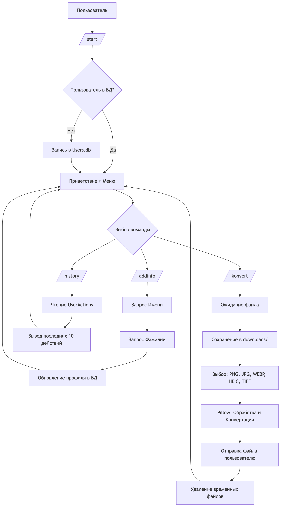

# 🤖 Telegram Image Converter

## 📊 Схема работы

## Команда,Описание
/start,"Инициализация, проверка регистрации и вывод меню."
/addinfo,Заполнение/изменение Имени и Фамилии в профиле.
/konvert,Режим смены формата изображения.
/history,Просмотр последних действий пользователя.

## 🚀 Основные возможности

* **Конвертация изображений:** Поддержка редких форматов, включая HEIC и TIFF (с LZW-сжатием).
* **Управление профилем:** Сбор данных о пользователях (Имя, Фамилия).
* **История действий:** База данных хранит последние 10 запросов пользователя.
* **Безопасность:** Автоматическая очистка временных файлов после обработки.
